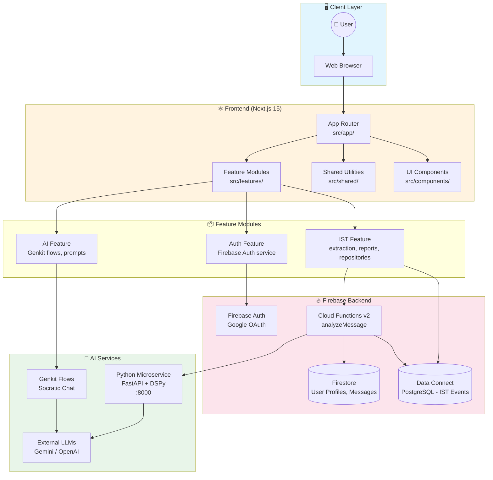
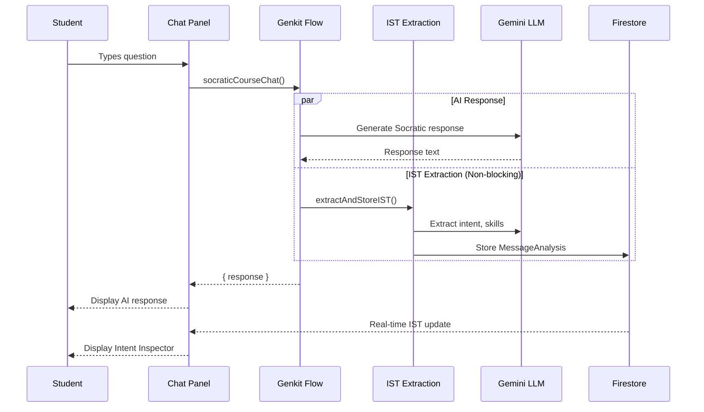
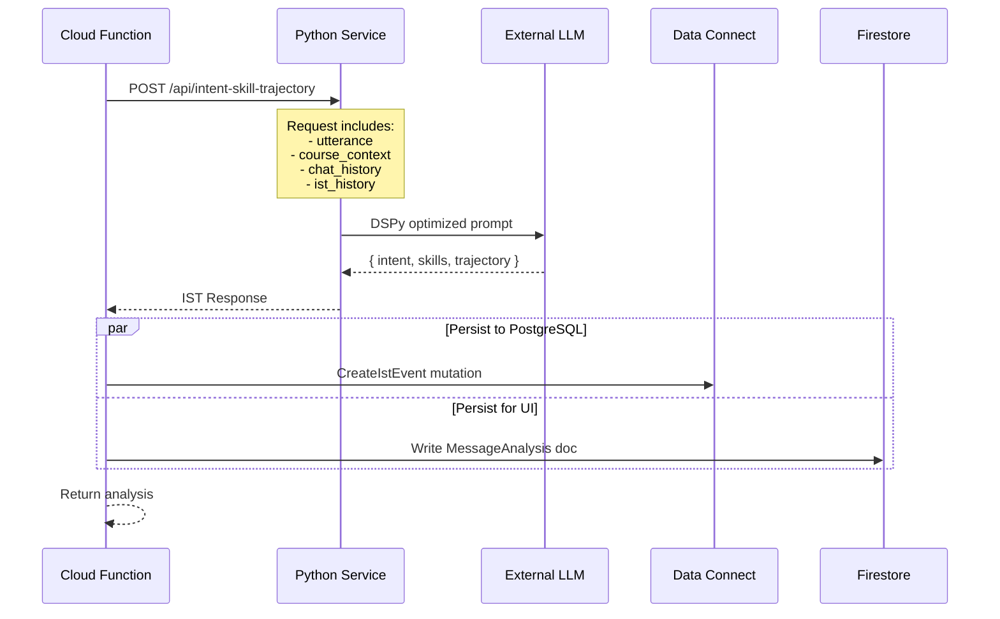
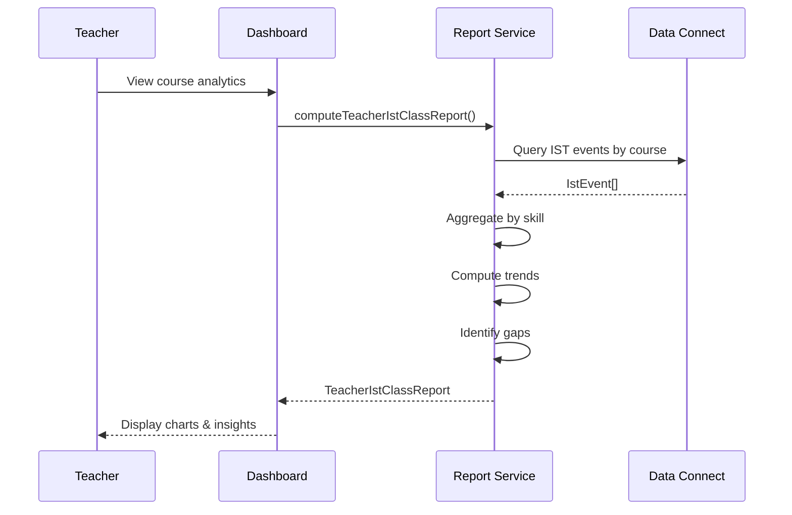
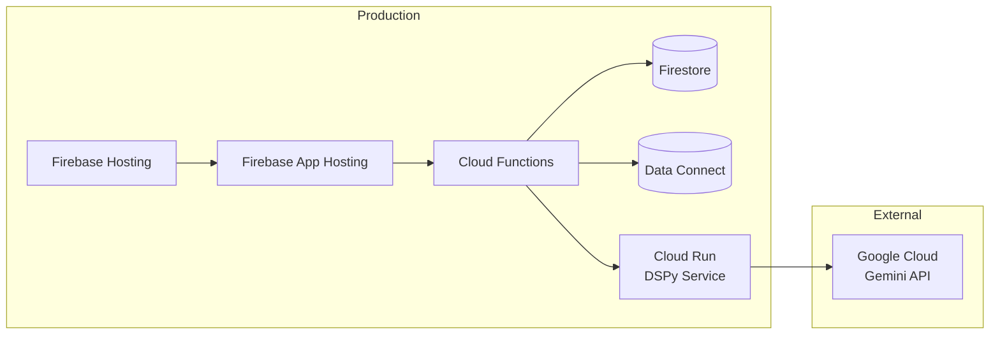

# CourseLLM System Architecture

**Version:** 1.0  
**Last Updated:** 2026-01-19  
**Status:** Production Ready

---

## Overview

CourseLLM is an AI-powered educational platform that provides Socratic tutoring for university students. The system extracts **Intent-Skill-Trajectory (IST)** analytics from student interactions to help teachers understand learning patterns.

This document describes the high-level architecture, technology stack, and data flow patterns.

---

## Architecture Diagram



---

## Technology Stack

### Frontend
| Technology | Version | Purpose |
|------------|---------|---------|
| **Next.js** | 15 | React framework with App Router |
| **React** | 18 | UI component library |
| **TypeScript** | 5 | Type-safe JavaScript |
| **Tailwind CSS** | 3.4 | Utility-first styling |
| **Radix UI** | Latest | Accessible UI primitives |
| **Genkit** | 1.24 | AI flow orchestration |

### Backend
| Technology | Version | Purpose |
|------------|---------|---------|
| **Firebase Auth** | 11 | Authentication (Google OAuth) |
| **Firestore** | 11 | NoSQL document database |
| **Firebase Data Connect** | Latest | GraphQL over PostgreSQL |
| **Cloud Functions** | v2 | Serverless backend logic |

### AI Services
| Technology | Version | Purpose |
|------------|---------|---------|
| **FastAPI** | Latest | Python REST API framework |
| **DSPy** | Latest | LLM prompt optimization |
| **Gemini** | 2.5-flash | Primary LLM provider |
| **OpenAI** | GPT-4o-mini | Alternative LLM provider |

### Development Tools
| Tool | Purpose |
|------|---------|
| **pnpm** | Node.js package manager |
| **uv** | Python package manager |
| **Playwright** | E2E testing |
| **Jest** | Unit testing |
| **Pytest** | Python testing |

---

## Folder Structure

```
CourseLLM/
├── src/
│   ├── app/                    # Next.js App Router
│   │   ├── api/                # API routes (REST endpoints)
│   │   ├── student/            # Student dashboard pages
│   │   ├── teacher/            # Teacher dashboard pages
│   │   ├── login/              # Authentication pages
│   │   └── layout.tsx          # Root layout
│   │
│   ├── features/               # 🎯 DOMAIN LOGIC (Feature-Based)
│   │   ├── ai/                 # AI flow definitions
│   │   │   ├── config/         # Genkit configuration
│   │   │   └── flows/          # Socratic chat, assessments
│   │   ├── ist/                # Intent-Skill-Trajectory
│   │   │   ├── api/            # IST API integration
│   │   │   ├── extraction/     # IST extraction logic
│   │   │   ├── reports/        # Teacher analytics
│   │   │   └── repositories/   # Data access patterns
│   │   ├── firebase.ts         # Firebase initialization
│   │   └── authService.ts      # Auth helper functions
│   │
│   ├── shared/                 # 🔧 FOUNDATIONAL CODE
│   │   ├── types/              # TypeScript type definitions
│   │   ├── hooks/              # React hooks (useMobile, useToast)
│   │   ├── lib/                # Utility functions
│   │   └── firebase/           # Firebase client utilities
│   │
│   └── components/             # 🎨 UI COMPONENTS
│       ├── ui/                 # shadcn/ui primitives
│       ├── layout/             # Navigation, headers
│       └── IntentInspector.tsx # IST visualization
│
├── functions/                  # ☁️ CLOUD FUNCTIONS
│   └── src/
│       ├── analyzeMessage.ts   # Main IST analysis function
│       ├── firebaseAdmin.ts    # Admin SDK initialization
│       └── dataconnect/        # Data Connect client
│
├── dspy_service/               # 🐍 PYTHON MICROSERVICE
│   ├── app.py                  # FastAPI application
│   ├── dspy_flows.py           # DSPy module definitions
│   └── tests/                  # Pytest test suite
│
├── dataconnect/                # 📊 DATA CONNECT SCHEMA
│   ├── schema/
│   │   └── ist_events.gql      # IST events table schema
│   └── connector/
│       └── ist_events_operations.gql
│
├── openspec/                   # 📋 FEATURE SPECIFICATIONS
│   ├── project.md              # Project conventions
│   ├── ist/                    # IST feature docs
│   ├── chat/                   # Chat feature docs
│   └── analytics/              # Analytics feature docs
│
└── tests/                      # 🧪 E2E TESTS
    └── e2e/                    # Playwright test specs
```

---

## Feature-Based Architecture

The codebase follows **Feature-Based Architecture** (a form of Domain-Driven Design):

### Principles

1. **Feature Isolation**: Each feature (`ist`, `ai`, `auth`) is self-contained
2. **Shared Foundation**: Common code lives in `src/shared/`
3. **Clear Boundaries**: Features don't directly import from each other
4. **Repository Pattern**: Data access abstracted behind interfaces

### Feature Module Structure

```
src/features/{feature}/
├── api/          # External API integration
├── extraction/   # Core business logic
├── reports/      # Analytics & aggregation
├── repositories/ # Data access layer
└── types.ts      # Feature-specific types
```

### Import Rules

```typescript
// ✅ ALLOWED
import { IstEvent } from '@/features/ist/types';
import { utils } from '@/shared/lib/utils';
import { Button } from '@/components/ui/button';

// ❌ FORBIDDEN
import { something } from '../../../features/chat/internal';
```

---

## Data Flow

### 1. Socratic Chat Flow



### 2. IST Analysis Pipeline



### 3. Teacher Analytics Flow



---

## API Endpoints

### Next.js API Routes (`/api/`)

| Endpoint | Method | Purpose |
|----------|--------|---------|
| `/api/health` | GET | Health check |
| `/api/analyze-message` | POST | Trigger IST analysis |
| `/api/dspy/quiz` | POST | Generate practice quiz |
| `/api/test-token` | GET | Test auth token (dev only) |

### Python Microservice (`:8000`)

| Endpoint | Method | Purpose |
|----------|--------|---------|
| `/health` | GET | Service health check |
| `/api/intent-skill-trajectory` | POST | IST extraction |

### Cloud Functions

| Function | Trigger | Purpose |
|----------|---------|---------|
| `analyzeMessage` | onCall | IST extraction with context enrichment |

---

## Database Schema

### Firestore Collections

```
users/{uid}
├── email: string
├── displayName: string
├── role: "student" | "teacher"
├── department: string
├── courses: string[]
└── profileComplete: boolean

threads/{threadId}/analysis/{messageId}
├── intent: { labels, primary, confidence }
├── skills: { items: Skill[] }
├── trajectory: { currentNodes, suggestedNextNodes, status }
└── metadata: { processedAt, modelVersion }
```

### Data Connect (PostgreSQL)

```graphql
type IstEvent @table {
  id: UUID! @default(expr: "uuidV4()")
  userId: String!
  courseId: String!
  threadId: String!
  messageId: String!
  utterance: String!
  intent: String!
  skills: Any @col(dataType: "jsonb")
  trajectory: Any @col(dataType: "jsonb")
  createdAt: Timestamp! @default(expr: "request.time")
}
```

---

## Environment Configuration

### Required Variables

```bash
# AI Services
GOOGLE_API_KEY=your-gemini-api-key
DSPY_SERVICE_URL=http://localhost:8000

# Firebase (Emulator Mode)
NEXT_PUBLIC_FIREBASE_USE_EMULATOR=true
FIRESTORE_EMULATOR_HOST=localhost:8080
FIREBASE_AUTH_EMULATOR_HOST=localhost:9099
```

### Service Ports

| Service | Port | URL |
|---------|------|-----|
| Next.js | 9002 | http://localhost:9002 |
| DSPy Service | 8000 | http://localhost:8000 |
| Firebase Auth | 9099 | http://localhost:9099 |
| Firestore | 8080 | http://localhost:8080 |
| Data Connect | 9400 | http://localhost:9400 |
| Emulator UI | 4000 | http://localhost:4000 |

---

## OpenSpec Documentation

Feature specifications follow the **OpenSpec** format in `/openspec/`:

| Feature | Files |
|---------|-------|
| **IST** | `openspec/ist/{proposal,spec,design,plan}.md` |
| **Chat** | `openspec/chat/{proposal,spec,design,plan}.md` |
| **Analytics** | `openspec/analytics/{proposal,spec,design,plan}.md` |

Each feature specification includes:
- **proposal.md** — Why the feature exists
- **spec.md** — Functional requirements
- **design.md** — Technical architecture
- **plan.md** — Implementation roadmap

---

## Security Considerations

1. **Authentication**: Firebase Auth with Google OAuth
2. **Authorization**: Firestore security rules enforce role-based access
3. **API Protection**: Test-only routes guarded by `ENABLE_TEST_AUTH` flag
4. **CORS**: Python service restricts origins to localhost:9002
5. **Secrets**: All API keys stored in `.env.local` (gitignored)

---

## Deployment Architecture



---

## References

- [SETUP.md](../SETUP.md) — Development setup guide
- [OpenSpec Project](../openspec/project.md) — Project conventions
- [Database Guide](./04-DATABASE-AND-DATA-FLOW.md) — Detailed data flow
- [DSPy Service README](../dspy_service/README.md) — Python service docs

